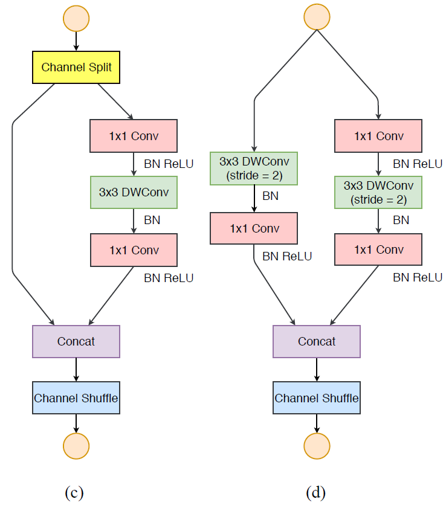
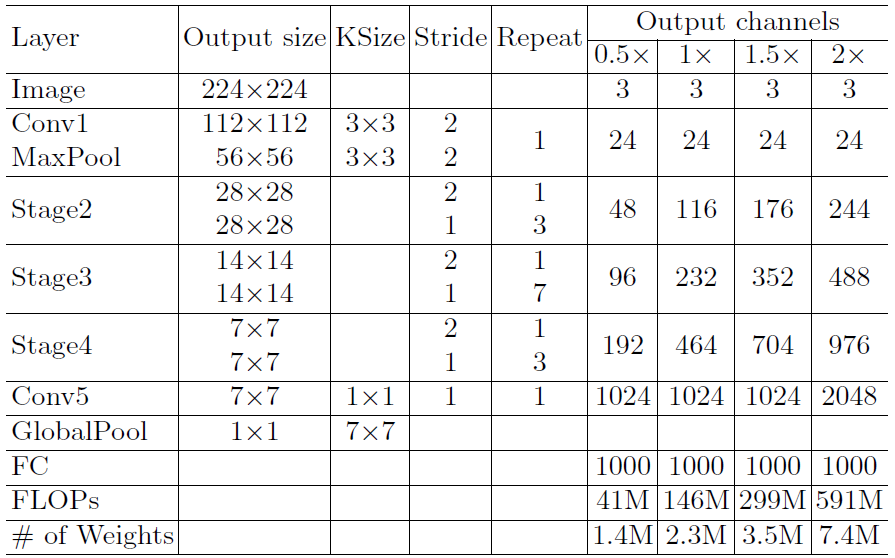
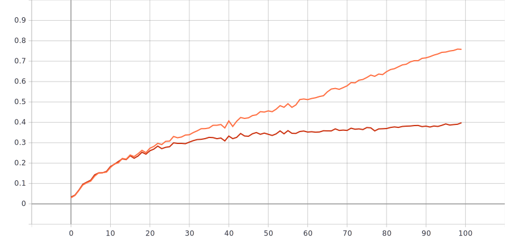
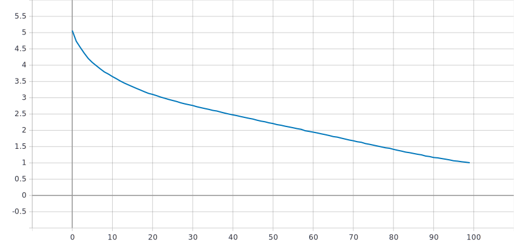
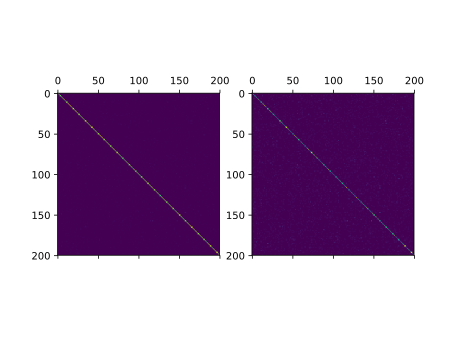

# ShuffleNet V2
> Implementation of [ShuffleNet V2: Practical Guidelines for Efficient CNN Architecture Design](https://arxiv.org/abs/1807.11164)

[TOC]

## 1 Introduction

In the paper of ShuffleNet V2, the authors focus on the analysis of several main metrics that affect the computing performance of CNN networks on GPU/ARM platforms, and propose some practical guidelines for efficient network design. Finally, these guidelines are applied to the improvement of ShuffleNet V1 network, that is, a novel architecture, ShuffleNet V2. Comprehensive experiments verify that the model proposed is state-of-the-art in terms of speed and accuracy tradeoff.

The authors propose that network architecture design should consider the direct metric such as speed, instead of the indirect metric like FLOPs. They demonstrate that following two reasons have considerable affection on speed: memory access cost (MAC) and degree of parallelism.

Based on the above analysis, the authors propose the following four practical guidelines for efficient network design:

* Equal channel width minimizes memory access cost (MAC)
* Excessive group convolution increases MAC
* Network fragmentation reduces degree of parallelism
* Element-wise operations are non-negligible

Each of the above guidelines is verified by empirical studies. 

According to the above guidelines, the authors design a new efficient architecture, which is ShuffleNet V2. Subsequently, they conduct several experiments on image classification task of ImageNet dataset and COCO object detection task to show that ShuffleNet V2 is state-of-the-art in terms of speed and accuracy tradeoff.

## 2 Dataset

The dataset used in the paper ([ShuffleNet V2](https://arxiv.org/abs/1807.11164)) is the ImageNet dataset (ILSVRC2012). However, the size of the full ImageNet is extremely large with a size of over 150 GB. Due to the limitation of GPU resources and time, I have to choose a smaller but similar dataset to conduct experiments.

The dataset chosen is Tiny ImageNet. Tiny ImageNet Challenge is the default course project for Stanford [CS231N](http://cs231n.stanford.edu/). It is similar to the classification challenge in the dataset in the full ImageNet ([ILSVRC](http://www.image-net.org/challenges/LSVRC/2012/index)). The dataset is available at [Tiny ImageNet Visual Recognition Challenge](https://tiny-imagenet.herokuapp.com/).

Tiny Imagenet has 200 classes. Each class has 500 training images, 50 validation images, and 50 test images. The training and validation sets are released with images and annotations. All images are 64x64 colored ones.

The training and validation sets of Tiny Imagenet are used here.

## 3 Implementation

> Version:
>
> - Python 3.7.3
> - pytorch 1.0.1
> - torchvision 0.2.2

The images are normalized by calculating the per-channel mean and per-channel standard deviation of the training data.

### 3.1 Hyper parameters

Hyper parameters and protocols refer to [ShuffleNet V2](https://arxiv.org/abs/1807.11164)

* epoch: 100
* optimizer: SGD
* batch size: 1024
* weight decay: 4e-5
* momentum: 0.9
* learning rate: linear-decay learning rate policy (decreased from 0.5 to 0)
* model: ShuffleNet V2 x2.0

### 3.2 Data augmentation

For the training data:

* `RandomHorizontalFlip` 

  Horizontally flip the image randomly with a probability of 0.5.

* `RandomVerticalFlip` 

  Vertically flip the image randomly with a probability of 0.5.

* `ColorJitter(brightness=0.2, contrast=0.2, saturation=0.2, hue=0.05)`

  Randomly change the brightness, contrast and saturation of an image. The factors of brightness, contrast and saturation are chosen uniformly from [0.8, 1.2], [0.8, 1.2], [0.95, 1.05] , respectively.

* `RandomResizedCrop(size=64)`

  A crop of random size (of 0.08 to 1.0) of the original size and a random aspect ratio (of 3/4 to 4/3) of the original aspect ratio is made. This crop is finally resized to 64x64. The interpolation method is bilinear.

For the validation data, the transformation of the fourth data augmentation of the training set is applied.

### 3.3 Network architecture

The architecture of ShuffleNet V2 is shown in Fig. 1 and Fig. 2. The network is constructed by following the instructions in the paper.

<table>
    <tr>
        <td>

            Fig. 1: Building blocks of ShuffleNet V2. (c) The basic unit; (d) The unit for spatial down sampling. DWConv: depthwise convolution. GConv: group convolution
</td>
    </tr>
</table>

<table>
    <tr>
        <td>

            Fig. 2: Overall architecture of ShuffleNet V2, for four different levels of complexities.
</td>
    </tr>
</table>

## 4 Results

Accuracy curves:

<table>
    <tr>
        <td>
            

			
Fig. 3: Accuracy curves of training set (orange curve) and validation set (red curve).  The x-axis is epoch, the y-axis is accuracy

        </td>
	</tr>
</table>

Training loss curve:

<table>
    <tr>
        <td>
            

			
Fig. 4: Loss curve of training set. The x-axis is epoch, the y-axis is loss

        </td>
	</tr>
</table>
Confusion matrices:

<table>
    <tr>
        <td>
            

             
			
Fig. 5: Confusion matrices of training set (left) and validation set (right).

        </td>
	</tr>
</table>

## 5 Problems

On account of the small amount of training data per class,  it is clear that the current model mainly suffers from the overfitting problem. The training accuracy is high, but the validation accuracy is low, which does not follow the training accuracy. Besides, the training epoch is not enough.

## 6 TODO

* Deal with the overfitting problem. Applying and adjusting regularization, dropout, data augmentation strategy are options.
* Hyper parameters tuning. Try to find a better setting of hyper parameters to train a relatively better model.
* Train the model with more epochs.
* Train the model with different network architecture proposes in the paper, which are ShuffleNet V2 x0.5, ShuffleNet V2 x1.0, ShuffleNetV2 x1.5. And the implementation of architecture for large models is optional, which are ShuffleNet V2-50, SE-ShuffleNet V2-164.
* If GPU resources and time are adequate, experiments on the full ImageNet dataset are worth to try.

## References

* [ShuffleNet: An Extremely Efficient Convolutional Neural Network for Mobile Devices](https://arxiv.org/abs/1707.01083)
* [ShuffleNet V2: Practical Guidelines for Efficient CNN Architecture Design](https://arxiv.org/abs/1807.11164)