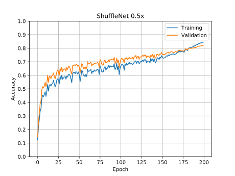

# Implementation of ShuffleNet V2

> Title: [ShuffleNet V2: Practical Guidelines for Efficient CNN Architecture Design](https://arxiv.org/abs/1807.11164)
>
> Authors: [Ningning Ma](https://arxiv.org/search/cs?searchtype=author&query=Ma%2C+N), [Xiangyu Zhang](https://arxiv.org/search/cs?searchtype=author&query=Zhang%2C+X), [Hai-Tao Zheng](https://arxiv.org/search/cs?searchtype=author&query=Zheng%2C+H), [Jian Sun](https://arxiv.org/search/cs?searchtype=author&query=Sun%2C+J)
>
> Name: 伍正涛
>
> Student ID: 16340246

[TOC]

## Abstract

> Abstract: problem, difficulty, idea, your key result.

In the paper ShuffleNet V2, the authors proposed a novel light weight convolutional neural network unit. Inspired by ShuffleNet V1, The authors redesign the structure of the basic unit in the network following the four guidelines proposed in the paper. We present the implementation of the paper ShuffleNet V2 by conducting experiments on two datasets, Tiny ImageNet, and ImageNet100 (introduce later), which are image classification tasks of 200 and 100 classes, respectively. We apply data augmentation and other regularization techniques to prevent the over-fitting problem. We construct the ShuffleNet V2 model from scratch following the instructions in the paper. Our best model achieves a top-1 accuracy of 43.34% on Tiny ImageNet and  87.21% on ImageNet100. Notice that all our model here were trained from scratch.

## 1 Introduction

> Introduction: application background, research problem, related existing methods, the paper's idea, your key results.

Convolutional neural networks (CNNs) have been proven to be useful methods for handling some of the computer vision tasks ever since [AlexNet](https://papers.nips.cc/paper/4824-imagenet-classification-with-deep-convolutional-neural-networks.pdf) by winning the ImageNet Challenge ([ILSVRC 2012](http://www.image-net.org/challenges/LSVRC/2012/index)). The architecture of CNNs has evolved for years, many excellent networks like VggNet, GoogLeNet, ResNet, DenseNets, ResNeXt, SENet, etc, have been proposed, becoming more accurate.

However, besides accuracy, computation complexity is an important consideration. A wide range of tasks in the real word usually require to obtain best accuracy under a limited computational budget, such as real-time processing in applications like self-driving, robotics and augmented reality.

In the paper of ShuffleNet V2, the authors focus on the analysis of several main metrics that affect the computing performance of CNNs on GPU/ARM platforms, and propose some practical guidelines for efficient network design. Finally, these guidelines are applied to the improvement of ShuffleNet V1 network, that is, a novel architecture, ShuffleNet V2. Comprehensive experiments verify that the model proposed is state-of-the-art in terms of speed and accuracy tradeoff.

The authors propose that network architecture design should consider the direct metric such as speed, instead of the indirect metric like FLOPs. They demonstrate that following two reasons have considerable affection on speed: memory access cost (MAC) and degree of parallelism.

Based on the above analysis, the authors propose the following four practical guidelines for efficient network design:

* G1: Equal channel width minimizes memory access cost (MAC)
* G2: Excessive group convolution increases MAC
* G3: Network fragmentation reduces degree of parallelism
* G4: Element-wise operations are non-negligible

Each of the above guidelines is verified by empirical studies. 

According to the above guidelines, the authors design a new efficient architecture, which is ShuffleNet V2. Subsequently, they conduct several experiments on image classification task of ImageNet dataset and COCO object detection task to show that ShuffleNet V2 is state-of-the-art in terms of speed and accuracy tradeoff.

In our project, we implement the network proposed in the paper ShuffleNet V2 and conduct image classification task on two datasets, Tiny ImageNet, and ImageNet100. We will present the key idea and model structure in the paper in the Method section. In the Implementation section, we introduce our data augmentation schemes and the detail of implementing the network. We conducted several experiments and their results are shown in the Experiments section.

## 2 Problem Formulation

> Problem formulation: formally describe the research problem.

The goal of our project is to implement the network proposed in the paper ShuffleNet V2 and use some datasets to test it. We also apply data augmentation and other regularization techniques to prevent the over-fitting problem, and hoping to obtain a better performance.

The dataset used in the paper is the ImageNet dataset (ILSVRC2012), which has 1000 classes of images. However, the size of the full ImageNet is extremely large with a size of over 150 GB. Due to the limitation of GPU resources and time, we have to choose smaller but similar datasets to conduct experiments. Two datasets are used in our project, Tiny ImageNet and ImageNet100.

Tiny ImageNet Challenge is the default course project for Stanford [CS231N](http://cs231n.stanford.edu/). It is similar to the classification challenge in the dataset in the full ImageNet ([ILSVRC](http://www.image-net.org/challenges/LSVRC/2012/index)). The dataset is available at [Tiny ImageNet Visual Recognition Challenge](https://tiny-imagenet.herokuapp.com/). Tiny Imagenet has 200 classes. Each class has 500 training images, 50 validation images and 50 test images. The training and validation sets are released with images and annotations. All images are 64x64 colored ones.

ImageNet100 dataset comes from the Internet. It chooses 100 classes of images from the full ImageNet. In ImageNet100, each class has 1000 training images, 200 validation images and 100 test images. The images in ImageNet100 comes from the full ImageNet without any modifications.

The training and validation sets of Tiny Imagenet and ImageNet100 are used in our project.

## 3 Method

> Method: the basic idea, model structure.

ShuffleNet V2 is an improvement of ShuffleNet V1 and the authors redesign its structure following the four guidelines proposed in the paper.

ShuffleNet V2 inherited the channel shuffle operation from ShuffleNet V1. Such a channel shuffle operation is able to enable information communication between different groups of channels and improve accuracy, which is shown in Fig. 1.

<table>
    <tr>
        <td>

</td>
    </tr>
</table>

Following the guidelines proposed in the paper, both pointwise group convolutions and bottleneck structures increase MAC (G1 and G2). And G3 implies that we should not use too many groups. According to G4, the element-wise "Add" operation in the shortcut connection is also undesirable. The key idea to construct the ShuffleNet V2 unit is to maintain a large number and equally wide channels with neither dense convolution nor too many groups.

The architecture of ShuffleNet V2 unit designed in the paper is shown in Fig. 3. At the beginning of the basic unit in Fig. 3 (c), there is a simple operator called channel split, which splits the feature channels into two branches. In the paper and the experiment, we use equal channel split, which means $c$ channels are split into two branches with $c/2$ and $c/2$ channels, respectively. One branch remains as identity, satisfying G3. To satisfy G1, The branch in the right consists of three convolutions with the same input and output channels.

The group-wise convolutions in the building blocks of ShuffleNet V1 in Fig. 3 (a) violates G2. As a result, the two 1 x 1 convolution in ShuffleNet V2 are no longer group-wise.

Then the two branches are concatenated as shown in Fig. 3. The number of channel stays the same, which satisfies G1. The following channel shuffle operation is used to enable information communication across the two branches.

After channel shuffling, the next unit begins and the "Add" operation in ShuffleNet V1 no longer exists. Afterward, the three element-wise operations, "Concat", "Channel Shuffle" and "Channel Split" are combined into one single element-wise operation. Such changes satisfy G4.

The unit for spatial down sampling is shown in Fig. 3 (d). The channel split operator is removed and thus the  number of output channels is doubled.

<table>
    <tr>
        <td>

</td>
    </tr>
</table>

The overall architecture of ShuffleNet V2 is shown in the table below.

<table>
    <tr>
        <td>

            Table. 1: Overall architecture of ShuffleNet V2, for four different levels of complexities.
</td>
    </tr>
</table>

## 4 Implementation

> what you have done, difficulties & solutions.

All the source code is written on my own and all the models here are trained from scratch.

### 3.1 Data Augmentation

Preventing over-fitting is an essential problem. The over-fitting issue is quite obvious In Tiny ImageNet dataset, which we only have 500 training images per class. The training accuracy is high, but the validation accuracy is low, which does not follow the training accuracy.

However, the over-fitting problem is not as obvious in ImageNet100 dataset as it is ImageNet. Because ImageNet100 have 1000 training images per class, the training data is quite adequate. The experiments on  ImageNet100 do not suffer from the over-fitting problem.

If we do not apply any data augmentation techniques, there would be over-fitting problems. However, if we use a too aggressive data augmentation scheme, the model would easily suffer from under-fitting, for our model is only a light weight model.

After experimenting with a large number of data augmentation combinations, we have come up with relatively good schemes.

For the training data of Tiny ImageNet, we firstly use `RandomResizedCrop`, a crop of random size (of 0.08 to 1.0) of the original size and a random aspect ratio (of 3/4 to 4/3) of the original aspect ratio is made. This crop is finally resized to 64 x 64. The interpolation method is bilinear. And then we apply `RandomHorizontalFlip`, horizontally flip the image randomly with a probability of 0.5.

* `RandomVerticalFlip` 

  Vertically flip the image randomly with a probability of 0.5.

* `ColorJitter(brightness=0.2, contrast=0.2, saturation=0.2, hue=0.05)`

  Randomly change the brightness, contrast and saturation of an image. The factors of brightness, contrast and saturation are chosen uniformly from [0.8, 1.2], [0.8, 1.2], [0.95, 1.05] , respectively.

* `RandomResizedCrop(size=64)`

  A crop of random size (of 0.08 to 1.0) of the original size and a random aspect ratio (of 3/4 to 4/3) of the original aspect ratio is made. This crop is finally resized to 64 x 64. The interpolation method is bilinear.
  
* `RandomHorizontalFlip` 

  Horizontally flip the image randomly with a probability of 0.5.

The validation data of Tiny ImageNet does not have any transformation because the sizes of all the images in Tiny ImageNet are 64 x 64.

The image sizes vary in ImageNet100. For the training data of ImageNet100, we firstly applied `RandomResizedCrop` to them and the output size is 224 x 224. And then we vertically flip the image randomly with a probability of 0.5. For the validation data of ImageNet100, we resize them to 256 x 256 and then crop them to 224 x 224 at the center.

After data augmentation transformations, the images are normalized by calculating the per-channel mean and per-channel standard deviation of the training data.

### 3.2 Network

In our project, we implement the ShuffleNet V2 network with the pytorch library in python. The network consists of 5 major stages, a global average pooling layer, and a fully connected layer.

In stage 1, there is a 3 x 3 convolutional layer with a stride of 2 and padding of 1 at the beginning. A batch normalization layer is added between the convolutional layer and its ReLU activation. Then there is a 3 x 3 max pooling layer with a stride of 2 and padding of 1.

From stage 2 to stage 4, four stages are stacked. We write the basic building block following the instructions in the paper and stack them together. The difficulty here is the channel shuffle operation. For the tensor to be performed channel shuffle, we firstly reshape it into the shape of (batch_size, groups, channels / groups, height, width), which is a 5 dimension tensor. The variable `groups` is always 2 in the network. Then we transpose the tensor at the second and the third dimensions (groups, channels / groups). Finally, we flatten these two dimensions to get a 4 dimension tensor. Now, we have performed the channel shuffle operation.

In stage 5, the layers are a 1 x 1 convolutional layer with a stride of 1 and padding of 0, a batch normalization layer and ReLU activation. Afterward, a global average pooling layer is added. Finally, there is a fully connected layer.

## 5 Experiments

### 5.1 Hyper parameters

Hyper parameters and protocols refer to the paper ShuffleNet V2. We tried a large number of hyper parameter combinations, and finally, we have come up with a relatively good one. The use SGD with a mini-batch size of 1024 for Tiny ImageNet and 200 for ImageNet100. The weight decay is set to 4e-5 instead of a higher value because our model here is only a small light weight network. The momentum is 0.9. We use a linear-decay learning rate policy (decreased from 0.5 to 0) as suggested in the paper.

### 5.2 Results

We train four levels of computation complexity (0.5x, 1.0x, 1.5x and 2.0x) of ShuffleNet V2, respectively with two datasets mentioned above.

#### 5.2.1 Tiny ImageNet

Accuracy table on validation set:

| Model              | Top-1 Validation Accuracy (%) |
| ------------------ | ----------------------------- |
| ShuffleNet V2 0.5x | 35.51                         |
| ShuffleNet V2 1.0x | 39.56                         |
| ShuffleNet V2 1.5x | 40.98                         |
| ShuffleNet V2 2.0x | 43.34                         |

Accuracy and loss curves:

<table>
    <tr>
        <td>
            

        </td>
        <td>
            

        </td>
	</tr>
    <tr>
        <td>
            

        </td>
        <td>
            

        </td>
	</tr>
    <tr>
        <td>
            

        </td>
        <td>
            

        </td>
	</tr>
    <tr>
        <td>
            

        </td>
        <td>
            

        </td>
	</tr>
</table>

Confusion matrices (The x-axis are predicted labels and the y-axis are true labels):

<table>
    <tr>
        <td>
            

            
ShuffleNet V2 0.5x, training set

        </td>
        <td>
            

            
ShuffleNet V2 0.5x, validation set

        </td>
	</tr>
    <tr>
        <td>
            

            
ShuffleNet V2 1.0x, training set

        </td>
        <td>
            

            
ShuffleNet V2 1.0x, validation set

        </td>
	</tr>
    <tr>
        <td>
            

            
ShuffleNet V2 1.5x, training set

        </td>
        <td>
            

            
ShuffleNet V2 1.5x, validation set

        </td>
	</tr>
    <tr>
        <td>
            

            
ShuffleNet V2 2.0x, training set

        </td>
        <td>
            

            
ShuffleNet V2 2.0x, validation set

        </td>
	</tr>
</table>

#### 5.2.2 ImageNet100

Accuracy table on validation set:

| Model              | Top-1 Validation Accuracy (%) |
| ------------------ | ----------------------------- |
| ShuffleNet V2 0.5x | 82.16                         |
| ShuffleNet V2 1.0x | 85.45                         |
| ShuffleNet V2 1.5x | 87.20                         |
| ShuffleNet V2 2.0x | 87.21                         |

Accuracy and loss curves:

<table>
    <tr>
        <td>
            

        </td>
        <td>
            

        </td>
	</tr>
    <tr>
        <td>
            

        </td>
        <td>
            

        </td>
	</tr>
    <tr>
        <td>
            

        </td>
        <td>
            

        </td>
	</tr>
    <tr>
        <td>
            

        </td>
        <td>
            

        </td>
	</tr>
</table>

Confusion matrices (The x-axis are predicted labels and the y-axis are true labels):

<table>
    <tr>
        <td>
            

            
ShuffleNet V2 0.5x, training set

        </td>
        <td>
            

            
ShuffleNet V2 0.5x, validation set

        </td>
	</tr>
    <tr>
        <td>
            

            
ShuffleNet V2 1.0x, training set

        </td>
        <td>
            

            
ShuffleNet V2 1.0x, validation set

        </td>
	</tr>
    <tr>
        <td>
            

            
ShuffleNet V2 1.5x, training set

        </td>
        <td>
            

            
ShuffleNet V2 1.5x, validation set

        </td>
	</tr>
    <tr>
        <td>
            

            
ShuffleNet V2 2.0x, training set

        </td>
        <td>
            

            
ShuffleNet V2 2.0x, validation set

        </td>
	</tr>
</table>

## *6 TODO

* Deal with the over-fitting problem. Applying and adjusting regularization, dropout, data augmentation strategy are options.
* Hyper parameters tuning. Try to find a better setting of hyper parameters to train a relatively better model.
* Train the model with more epochs.
* Train the model with different network architecture proposes in the paper, which are ShuffleNet V2 x0.5, ShuffleNet V2 x1.0, ShuffleNetV2 x1.5. And the implementation of architecture for large models is optional, which are ShuffleNet V2-50, SE-ShuffleNet V2-164.
* If GPU resources and time are adequate, experiments on the full ImageNet dataset are worth to try.

## Conclusion

## References

* [ShuffleNet: An Extremely Efficient Convolutional Neural Network for Mobile Devices](https://arxiv.org/abs/1707.01083)
* [ShuffleNet V2: Practical Guidelines for Efficient CNN Architecture Design](https://arxiv.org/abs/1807.11164)